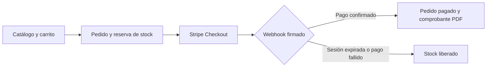

<p align="center">
  
</p>

<h1 align="center">Bazar Central</h1>

<p align="center">Una tienda en línea conectada con la operación comercial de un bazar.</p>

<p align="center">
  <a href="https://sistema-comercial-bazar.onrender.com/">Visitar la tienda</a> ·
  <a href="https://sistema-comercial-bazar.onrender.com/gestion">Explorar la gestión</a> ·
  <a href="docs/DEPLOYMENT.md">Guía de despliegue</a>
</p>


Bazar Central reúne un catálogo navegable, carrito, pedidos y pagos con **Stripe Checkout en modo de prueba**. La misma aplicación incluye herramientas para administrar productos, proveedores, clientes, empleados y compras. Está construida con Java y Spring Boot, con vistas Thymeleaf y persistencia mediante Spring Data JPA.

## Recorrido por el sistema

| Área | Qué permite hacer |
| --- | --- |
| [Tienda](https://sistema-comercial-bazar.onrender.com/) | Explorar categorías, ordenar productos, consultar disponibilidad y preparar el carrito. |
| Compra | Abrir Stripe Checkout, seguir el estado del pedido y descargar un comprobante PDF cuando se confirma el pago. |
| [Vista de gestión](https://sistema-comercial-bazar.onrender.com/gestion) | Conocer las secciones de productos, pedidos y compras sin modificar registros ni consultar datos privados. Sus contenidos son ilustrativos. |
| Panel administrativo | Gestionar registros comerciales y consultar los pedidos en línea con una cuenta `ADMIN` configurada por el responsable del servicio. |

<details>
<summary>Ver la vista pública de gestión</summary>


</details>

### Del carrito a la confirmación



El servidor calcula los importes a partir de los productos guardados, reserva las unidades antes de crear la sesión de pago y confirma el pedido **mediante el webhook de Stripe**, no por la visita a la página de retorno. Una tarea periódica concilia sesiones pendientes para recuperar eventos no recibidos. El PDF es un comprobante informativo; no es una factura tributaria.

## Tecnologías

| Capa | Herramientas |
| --- | --- |
| Interfaz | Thymeleaf, HTML, CSS y JavaScript |
| Servidor | Java 21, Spring Boot, Spring MVC y Spring Security |
| Datos | Spring Data JPA, PostgreSQL en el despliegue y H2 en la ejecución local predeterminada |
| Pagos y documentos | Stripe Checkout, webhooks y Apache PDFBox |
| Construcción y despliegue | Maven Wrapper, Docker y Render |

El código sigue una estructura de **controladores, servicios, repositorios y entidades**. Las rutas administrativas están protegidas con Spring Security; `/gestion` es una vista pública de consulta separada del panel real.

## Ejecutar en local

Necesitas **JDK 21 o superior**. El repositorio incluye Maven Wrapper, por lo que no hace falta instalar Maven por separado. La primera ejecución necesita acceso a Maven Central para descargar dependencias.

<details open>
<summary>Windows / PowerShell</summary>

```powershell
.\mvnw.cmd clean test
.\mvnw.cmd spring-boot:run
```

</details>

<details>
<summary>macOS / Linux</summary>

```bash
./mvnw clean test
./mvnw spring-boot:run
```

</details>

Abre [http://localhost:8080](http://localhost:8080). Por defecto se activa el perfil `demo`: carga el catálogo en **H2 en memoria** y restablece los datos al reiniciar. El catálogo y el carrito funcionan sin servicios externos; para abrir Stripe Checkout, configura las variables de la sección siguiente.

### Probar el pago con Stripe

1. Obtén las claves `sk_test_` y `pk_test_` de tu cuenta en [Stripe Dashboard](https://dashboard.stripe.com/test/apikeys). El código solo acepta claves de prueba.
2. Instala [Stripe CLI](https://docs.stripe.com/stripe-cli), ejecuta `stripe login` y, en otra terminal, inicia el reenvío de eventos:

   ```bash
   stripe listen --forward-to localhost:8080/stripe/webhook
   ```

3. Copia el secreto `whsec_` que muestra la CLI. En la terminal donde iniciarás la aplicación, define las variables y arráncala. Por ejemplo, en PowerShell:

   ```powershell
   $env:CHECKOUT_MODE = 'stripe-test'
   $env:STRIPE_SECRET_KEY = '<tu sk_test_...>'
   $env:STRIPE_PUBLISHABLE_KEY = '<tu pk_test_...>'
   $env:STRIPE_WEBHOOK_SECRET = '<el whsec_... de Stripe CLI>'
   $env:PUBLIC_BASE_URL = 'http://localhost:8080'
   .\mvnw.cmd spring-boot:run
   ```

4. Añade productos al carrito y continúa al pago. Usa una fecha futura, cualquier CVC de tres dígitos y una [tarjeta de prueba de Stripe](https://docs.stripe.com/testing):

   | Número de tarjeta | Resultado |
   | --- | --- |
   | `4242 4242 4242 4242` | Pago aprobado; el webhook confirma el pedido y habilita el PDF. |
   | `4000 0000 0000 0002` | Pago rechazado; no se genera comprobante. |
   | `4000 0000 0000 3220` | Solicita autenticación 3D Secure. |

No uses datos bancarios reales. La página de retorno puede mostrar el pedido como pendiente durante unos instantes mientras llega el webhook. El enlace de retorno contiene identificadores del pedido y la sesión; evita compartirlo.

## Configuración

| Variable | Función |
| --- | --- |
| `SPRING_PROFILES_ACTIVE` | `demo` por defecto; `prod` para PostgreSQL. |
| `PORT` | Puerto HTTP; `8080` por defecto. |
| `JDBC_DATABASE_URL`, `DB_USERNAME`, `DB_PASSWORD` | Conexión PostgreSQL obligatoria con `prod`. |
| `APP_SEED_CATALOG` | Con `true` en `prod`, carga el catálogo inicial únicamente si no hay productos. |
| `CHECKOUT_MODE` | `disabled` por defecto; `stripe-test` para habilitar Checkout. |
| `STRIPE_SECRET_KEY`, `STRIPE_PUBLISHABLE_KEY` | Claves `sk_test_` y `pk_test_` de la misma cuenta Stripe. |
| `STRIPE_WEBHOOK_SECRET` | Secreto `whsec_` del endpoint de webhook. |
| `PUBLIC_BASE_URL` | Origen público HTTPS sin ruta; en local se admite `http://localhost:8080`. Render proporciona `RENDER_EXTERNAL_URL` si se omite. |
| `ADMIN_USERNAME`, `ADMIN_PASSWORD` | Crea o actualiza la única cuenta administrativa activa. La contraseña debe tener al menos 12 caracteres. |

No hay usuario ni contraseña administrativos predeterminados. Si faltan ambas variables `ADMIN_*`, las cuentas administrativas quedan desactivadas. El acceso está en `/admin/login`; el listado de pedidos, en `/admin/pedidos`. Conserva contraseñas, claves de Stripe y credenciales de PostgreSQL fuera del repositorio.

## Despliegue

El [`Dockerfile`](Dockerfile) construye y ejecuta la aplicación con Java 21. [`render.yaml`](render.yaml) define el servicio web con el perfil `prod`; la base PostgreSQL y los secretos se configuran en el alojamiento. Para habilitar los pagos en el sitio público, registra en Stripe el endpoint `https://TU_DOMINIO/stripe/webhook` con los eventos `checkout.session.completed`, `checkout.session.expired`, `checkout.session.async_payment_succeeded` y `checkout.session.async_payment_failed`.

Consulta la [guía de despliegue](docs/DEPLOYMENT.md) para configurar Render, PostgreSQL y Stripe paso a paso. En producción se necesita una base persistente para conservar pedidos y asociarlos con los eventos del webhook. El proyecto mantiene Stripe exclusivamente en modo de prueba; los pagos no realizan cargos reales. El perfil `prod` utiliza actualmente `ddl-auto=update`: antes de evolucionar el esquema con datos importantes, conviene incorporar migraciones versionadas y copias de seguridad.

---

Las imágenes del catálogo forman parte de la interfaz actual. Antes de reutilizarlas en otro proyecto, verifica sus derechos de uso.
